<div align="center">

# Bank UI Kit

**A production-grade Flutter UI component library for mobile banking and fintech apps.**

Independently themeable · RTL-aware · WCAG 2.1 AA · state-management agnostic · 65+ widgets

[](https://github.com/sayed3li97/bank-ui-kit/actions/workflows/ci.yml)
[](LICENSE)
[](https://flutter.dev)
[](https://pub.dev/packages/flutter_lints)

<table>
  <tr>
    <td align="center"><b>Studio</b></td>
    <td align="center"><b>Voltage</b></td>
    <td align="center"><b>Bloom</b></td>
  </tr>
  <tr>
    <td>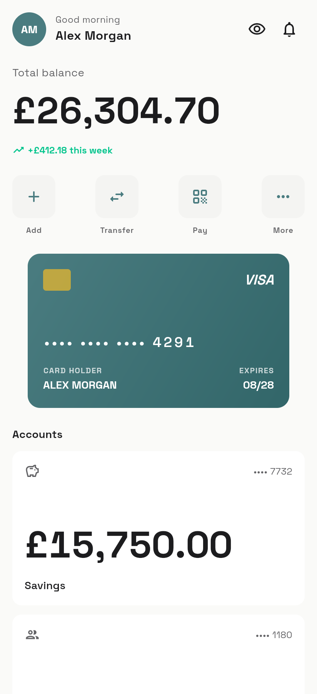</td>
    <td>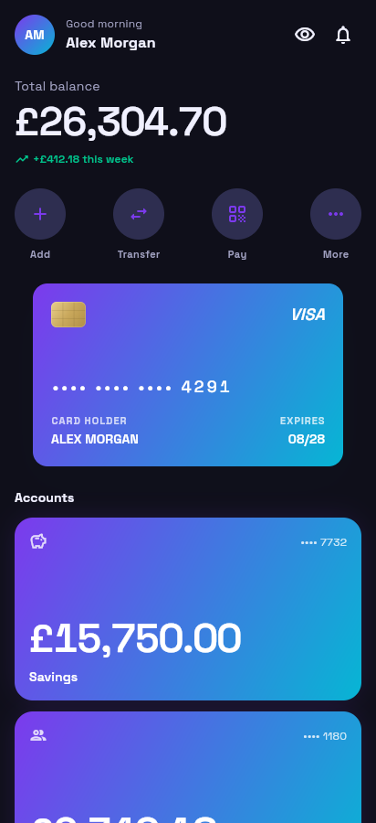</td>
    <td>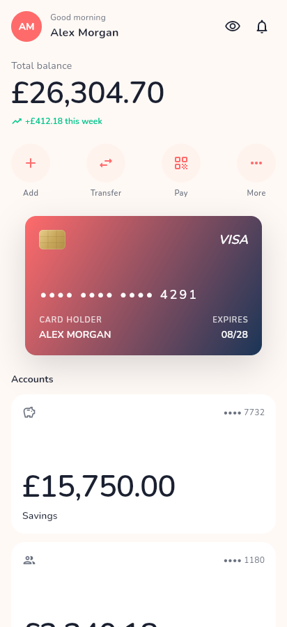</td>
  </tr>
</table>

*The same home dashboard, composed from the same widgets, rendered under three drop-in design presets.*

</div>

---

## Contents

- [Why Bank UI Kit](#why-bank-ui-kit)
- [Install](#install)
- [Quick start](#quick-start)
- [Design presets](#design-presets)
- [Custom themes](#custom-themes)
- [Component catalogue](#component-catalogue)
- [Cross-cutting features](#cross-cutting-features)
- [Architecture & principles](#architecture--principles)
- [Running the example](#running-the-example)
- [Contributing](#contributing)
- [License](#license)

---

## Why Bank UI Kit

| | Bank UI Kit | Typical screen-template kits |
|---|---|---|
| **Integration model** | Compose into any existing app | Copy-paste whole screens |
| **Theming** | 3 presets + fully custom themes, runtime-switchable | Fork the package |
| **RTL support** | First-class, every widget | Mirror-on-demand or none |
| **Accessibility** | WCAG 2.1 AA, 44×44 targets, semantics | Not specified |
| **State management** | Agnostic (pure props + callbacks) | Tied to the template's choice |
| **Money** | Lossless `Decimal`-backed `Money` type | `double` |
| **Tests** | Unit + widget tests across presets | None |

Everything is a **widget you drop into your own screens** — not a finished app you have to adopt wholesale.

---

## Install

```yaml
dependencies:
  bank_ui_kit:
    git:
      url: https://github.com/sayed3li97/bank-ui-kit.git
```

Import only the modules you use:

```dart
import 'package:bank_ui_kit/core.dart';       // accounts, transactions, transfers, cards, auth, states, insights…
import 'package:bank_ui_kit/saving.dart';     // pots, round-ups, income sorter
import 'package:bank_ui_kit/social.dart';     // joint accounts, shared goals, peer payments
import 'package:bank_ui_kit/investing.dart';  // wallets, holdings, buy/sell, charts
import 'package:bank_ui_kit/credit.dart';     // installments, credit gauges, subscriptions, perks
```

---

## Quick start

Wrap your app in a `BankUiScope` and apply a preset to your `ThemeData`:

```dart
import 'package:bank_ui_kit/core.dart';
import 'package:flutter/material.dart';

void main() => runApp(const MyApp());

class MyApp extends StatelessWidget {
  const MyApp({super.key});

  @override
  Widget build(BuildContext context) {
    return BankUiScope(
      initialData: const BankUiScopeData(preset: BankPreset.studio),
      child: MaterialApp(
        theme: BankPreset.studio.apply(ThemeData.light(useMaterial3: true)),
        darkTheme: BankPreset.studio.apply(ThemeData.dark(useMaterial3: true)),
        home: const Dashboard(),
      ),
    );
  }
}
```

Then compose with the widgets:

```dart
BankBalanceText(money: account.balance, size: BankBalanceSize.hero),
BankVirtualCardWidget(account: account, cardholderName: 'ALEX MORGAN'),
BankTransactionListTile(transaction: tx, onTap: () { /* open detail */ }),
```

---

## Design presets

Three first-class presets ship in the box. Each defines a complete `BankThemeData`
(colours, shape radii, elevation/glow, brand font, numeral typography) in light **and** dark.

| Preset | Personality | Signature |
|---|---|---|
| **Studio** | Restrained, editorial | Petrol-green, 12 px corners, hairline borders, Space Grotesk |
| **Voltage** | Electric, dark-native | Violet→cyan gradient, pill shapes, glow depth |
| **Bloom** | Warm, consumer-friendly | Coral primary, fully-rounded, Nunito |

Switch presets at runtime by changing the `ThemeData` you pass to `MaterialApp` —
every widget re-themes itself because it reads tokens from `BankThemeData.of(context)`.

<table>
  <tr>
    <td align="center">Accounts · Studio</td>
    <td align="center">Accounts · Voltage</td>
    <td align="center">Accounts · Bloom</td>
  </tr>
  <tr>
    <td>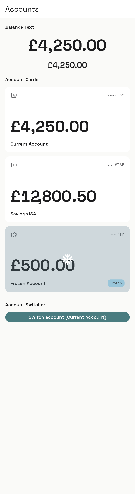</td>
    <td>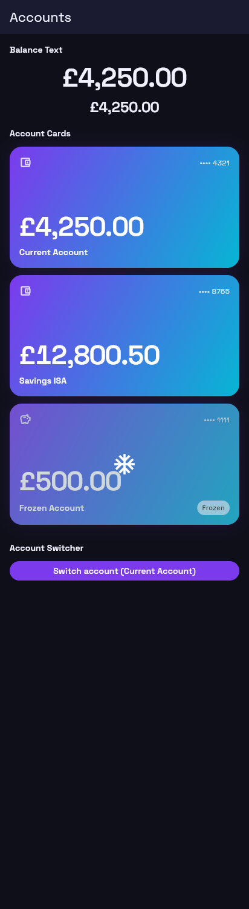</td>
    <td>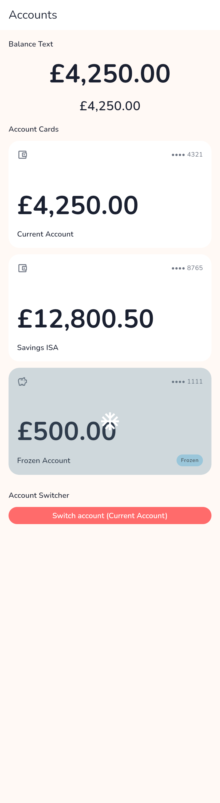</td>
  </tr>
</table>

---

## Custom themes

Not limited to the three presets — build a fully custom theme from your brand colour.
Only `primary` and `brightness` are required; every other token has a sensible default.

```dart
final myTheme = BankThemeData.custom(
  primary: const Color(0xFF0052CC),
  brightness: Brightness.light,
  // optionally override any token:
  cardRadius: const BorderRadius.all(Radius.circular(20)),
  useGlow: true,
  glowColor: const Color(0x440052CC),
  accentGradient: const LinearGradient(
    colors: [Color(0xFF0052CC), Color(0xFF00B8D9)],
  ),
);

MaterialApp(
  theme: ThemeData.light(useMaterial3: true).withBankTheme(myTheme),
  darkTheme: ThemeData.dark(useMaterial3: true).withBankTheme(
    BankThemeData.custom(
      primary: const Color(0xFF4D9DFF),
      brightness: Brightness.dark,
    ),
  ),
);
```

`withBankTheme()` registers the theme extension **and** synchronises the Material
`ColorScheme`, so Material widgets and Bank UI Kit widgets stay consistent.

You can also start from a preset and override just the fields that differ:

```dart
final tweaked = BankPreset.bloom
    .apply(ThemeData.light(useMaterial3: true))
    .extension<BankThemeData>()!
    .copyWith(primary: const Color(0xFFE91E63));
```

---

## Component catalogue

65+ widgets across 14 modules. Each screenshot below is a live render of that module's
showcase screen (Studio preset, light mode) from the example app.

### States & feedback
`BankSkeletonLoader` · `BankEmptyStateView` · `BankErrorStateView` · `BankSuccessAnimation` · `BankToastBanner` · `BankFraudAlertBanner`

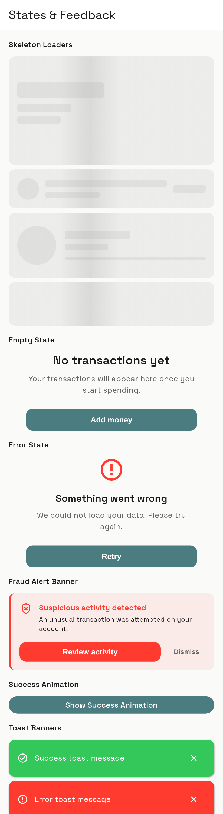

### Accounts & balances
`BankAccountCard` · `BankAccountSwitcher` · `BankBalanceText` (privacy-aware)

### Transactions
`BankTransactionListTile` · `BankTransactionGroupHeader` · `BankTransactionDetailSheet` · `BankTransactionFilterSheet` · `BankReceiptView` · `BankTransactionCostSplitSheet` · `BankTransactionCategorySplitSheet`

<br clear="right" />

| Transactions | Transfers | Cards |
|---|---|---|
| 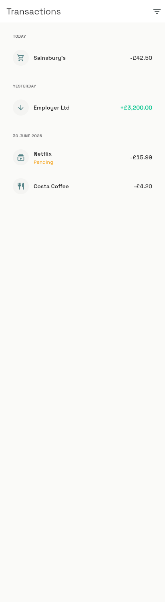 | 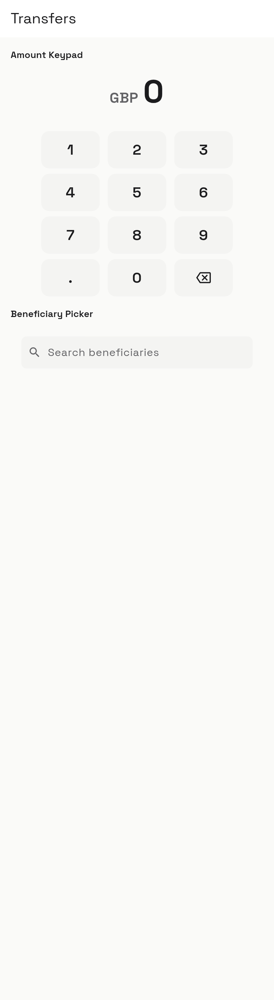 | 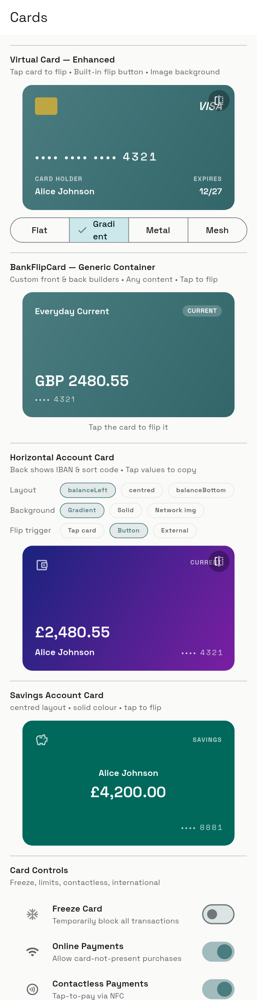 |

**Transfers & payments** — `BankAmountKeypad` · `BankBeneficiaryPicker` · `BankTransferReviewCard` · `BankTransactionPinSheet` · `BankScheduledTransferToggle` · `BankPaymentRequestCard` · `BankTransferResultScreen` · `BankContactPaymentSheet`

**Cards** — `BankFlipCard` · `BankHorizontalAccountCard` · `BankVirtualCardWidget` (flat / gradient / mesh / metallic / image) · `BankCardControlsPanel` · `BankCardPinManager` · `BankPhysicalCardMaterialPicker`

### Flip cards

Smooth 3-D perspective flip animation revealing the account details on the back face.
Three trigger modes, two flip axes, three front-face layouts, and three background modes
ship in the box — all backward-compatible and opt-in.

<table>
  <tr>
    <td align="center">Cards · Studio</td>
    <td align="center">Cards · Voltage</td>
    <td align="center">Cards · Bloom</td>
  </tr>
  <tr>
    <td></td>
    <td>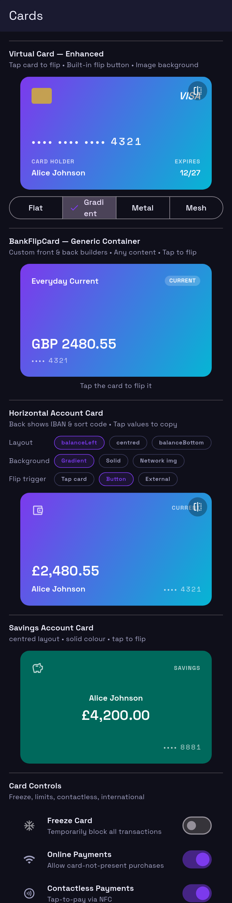</td>
    <td>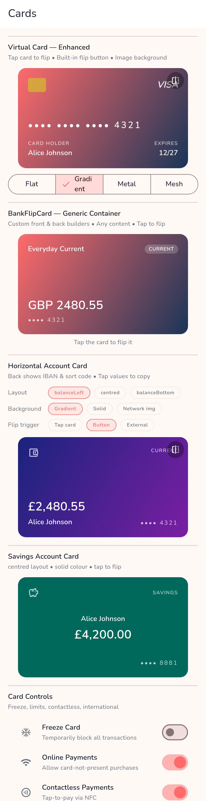</td>
  </tr>
</table>

#### `BankFlipCard` — generic flip container

Wraps any two widgets in a perspective flip. Use it for any two-sided surface.

```dart
BankFlipCard(
  trigger: BankFlipTrigger.tapToFlip,  // tapToFlip · builtInButton · external
  flipAxis: BankFlipAxis.horizontal,   // horizontal (Y-axis) · vertical (X-axis)
  flipDuration: const Duration(milliseconds: 400),
  flipCurve: Curves.easeInOutCubic,
  frontBuilder: (ctx, _) => MyFront(),
  backBuilder:  (ctx, _) => MyBack(),
)
```

#### `BankHorizontalAccountCard` — landscape account card with flip

A landscape-format bank card showing balance, masked number, and account-type icon on
the front. The back reveals the full IBAN / account number and sort code / BIC with
tap-to-copy actions.

```dart
BankHorizontalAccountCard(
  account: myAccount,
  cardholderName: 'Alice Johnson',
  // Front-face layout
  layout: BankHorizontalCardLayout.centred,        // balanceLeft · centred · balanceBottom
  // Background
  background: BankHorizontalCardBackground.image,  // themeGradient · solidColor · image
  backgroundImage: const AssetImage('assets/card_bg.jpg'),
  backgroundImageOverlay: Colors.black54,
  // Flip
  trigger: BankFlipTrigger.builtInButton,
  flipAxis: BankFlipAxis.horizontal,
)
```

External (host-controlled) flip — pair `isFlipped` with `onFlip`:

```dart
bool _flipped = false;

BankHorizontalAccountCard(
  account: myAccount,
  trigger: BankFlipTrigger.external,
  isFlipped: _flipped,
  onFlip: () => setState(() => _flipped = !_flipped),
)
```

#### Enhanced `BankVirtualCardWidget`

The existing virtual-card widget now accepts an image background and an explicit flip
trigger. All new parameters are optional — existing code compiles unchanged.

```dart
BankVirtualCardWidget(
  account: account,
  cardholderName: 'ALEX MORGAN',
  // new: image background
  backgroundImage: const NetworkImage('https://example.com/card.jpg'),
  // new: flip trigger (default: tapToFlip — same as before)
  flipTrigger: BankFlipTrigger.builtInButton,
  // new: optional custom flip button
  flipButtonBuilder: (ctx, flip) => IconButton(
    icon: const Icon(Icons.flip),
    onPressed: flip,
  ),
)
```

| Auth & security | Onboarding & KYC | Saving |
|---|---|---|
| 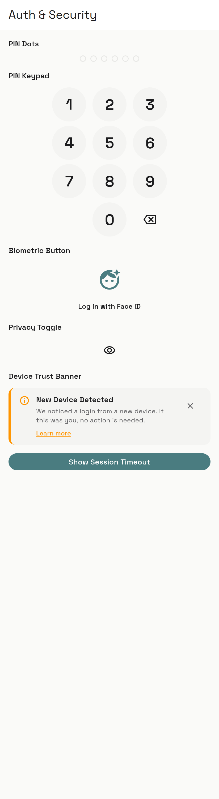 | 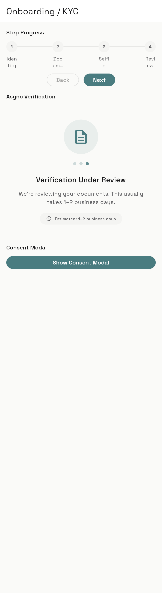 | 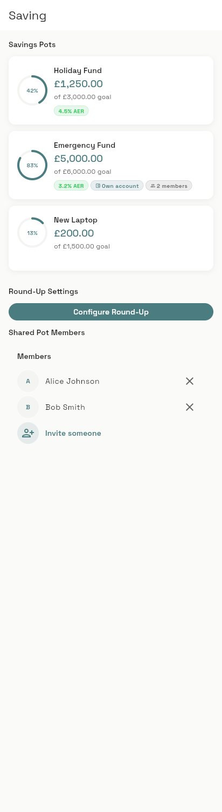 |

**Auth & security** — `BankPinKeypad` · `BankPinDots` · `BankBiometricPromptButton` · `BankPrivacyToggle` · `BankDeviceTrustBanner` · `BankSessionTimeoutDialog` · `BankAppSwitcherPrivacyOverlay`

**Onboarding & KYC** — `BankStepProgressIndicator` · `BankDocumentCaptureOverlay` · `BankLivenessCheckOverlay` · `BankAsyncVerificationState` · `BankConsentModal`

**Saving** — `BankSavingsPotCard` · `BankRoundUpSettingsSheet` · `BankPotContributionSheet` · `BankIncomeSorterSheet` · `BankSharedPotInvite`

| Social | Investing | Credit |
|---|---|---|
| 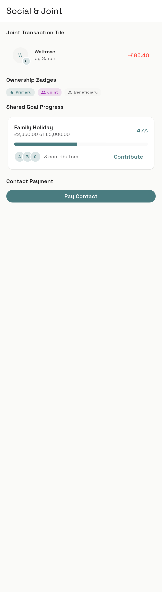 | 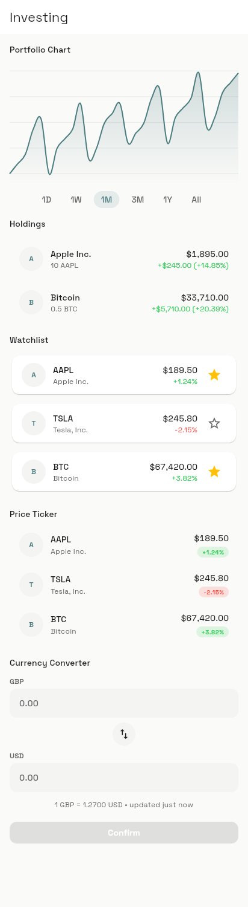 | 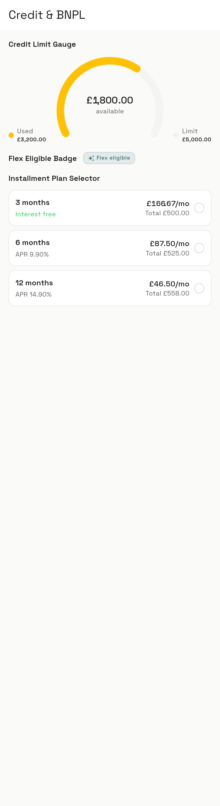 |

**Social** — `BankJointTransactionListTile` · `BankAccountOwnershipBadge` · `BankSharedGoalProgressCard`

**Investing** — `BankPortfolioPerformanceChart` · `BankHoldingsListTile` · `BankWatchlistCard` · `BankBuySellSheet` · `BankAssetPriceTicker` · `BankLiveExchangeConverter` · `BankCurrencyWalletTabBar`

**Credit** — `BankCreditLimitGauge` · `BankFlexEligibleBadge` · `BankInstallmentPlanSelector` · `BankRepaymentScheduleView`

| Subscriptions | Insights | Notifications |
|---|---|---|
| 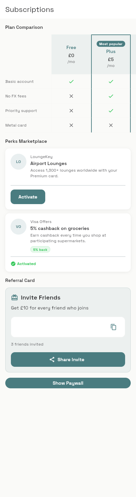 | 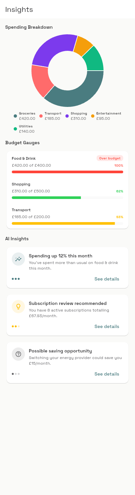 | 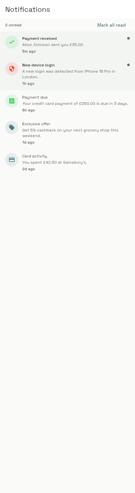 |

**Subscriptions** — `BankPlanComparisonTable` · `BankPaywallSheet` · `BankPerksMarketplaceCard` · `BankReferralInviteCard`

**Insights** — `BankSpendingBreakdownChart` (donut) · `BankBudgetGaugeWidget` · `BankInsightCard`

**Notifications** — `BankInAppNotificationCenter`

---

## Cross-cutting features

### Privacy mode
`BankPrivacyToggle` flips `BankUiScope.privacyEnabled`; every `BankBalanceText` masks itself automatically.

```dart
BankBalanceText(money: account.balance) // shows '••••' when privacy is on
```

### Numeral styles
Western or Eastern Arabic-Indic digits, independent of locale — ideal for GCC apps.

```dart
BankUiScope(
  initialData: BankUiScopeData(numeralStyle: NumeralStyle.easternArabicIndic),
  child: ...,
)
```

### Islamic finance mode
Swaps interest/APR labels for profit-rate equivalents wherever a widget renders label text.

```dart
BankUiScope(initialData: BankUiScopeData(islamicFinanceMode: true), child: ...)
```

### Localization
Ships English strings; override any subset via `BankUiStrings` — no `gen-l10n` dependency.

### RTL
Every widget is built and tested under `TextDirection.rtl`.

---

## Architecture & principles

- **Tokens, not magic numbers.** Widgets read colours, radii, spacing, elevation, and
  numeral typography from `BankThemeData` / `BankTokens` — never hard-coded.
- **State-management agnostic.** Pure widgets: data in via the constructor, events out
  via callbacks. No provider/bloc/riverpod coupling in `lib/`.
- **Lossless money.** The `Money` type wraps `Decimal`; no `double` ever touches an amount.
- **Headless flow controllers.** `BankKycFlowController`, `BankTransferFlowController`, and
  `BankIncomeSorterController` own multi-step flow state so you can swap the visual layer.
- **Bring your own imagery.** Widgets expose `Widget? illustration` slots; the kit bundles
  no raster/vector art.

```
lib/
  core.dart · saving.dart · social.dart · investing.dart · credit.dart   # barrels
  src/
    theme/      # BankTokens, BankThemeData, presets, custom theming
    scope/      # BankUiScope + BankUiStrings
    models/     # Money, Transaction, BankAccount, …  (==, hashCode, copyWith)
    <feature>/  # one folder per module
    controllers/# headless flow controllers
```

---

## Running the example

The example app is both an **interactive component gallery** and a **Revolut-style demo dashboard**,
with live preset / dark-mode / RTL switches in the app bar.

```bash
cd example
flutter pub get
flutter run         # mobile / desktop
# or: flutter run -d chrome
```

### Regenerating the screenshots

Screenshots in this README are produced from the real widgets via Flutter web:

```bash
cd example
flutter build web -t lib/screenshot_harness.dart --release --no-web-resources-cdn --no-tree-shake-icons
cd ..
node tools/screenshots.mjs          # requires playwright + a Chromium
```

---

## Contributing

See [CONTRIBUTING.md](CONTRIBUTING.md) and our [Code of Conduct](CODE_OF_CONDUCT.md).
In short: `flutter analyze` and `flutter test` must be green, and every change must work
across all three presets, both brightnesses, and RTL.

---

## License

[MIT](LICENSE) © 2026 Sayed Ali and Bank UI Kit contributors.

Fonts bundled with the kit — [Space Grotesk](https://github.com/floriankarsten/space-grotesk),
[Fredoka](https://github.com/hafontia/Fredoka), and [Nunito](https://github.com/googlefonts/nunito) —
are licensed under the SIL Open Font License.
