## Component Reference

### Accounts & Balances

#### BankBalanceText

Currency-formatted text that automatically masks the balance when privacy mode is active, with a 150 ms cross-fade transition between hidden and visible states.

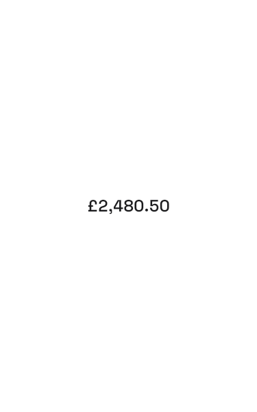

| Parameter | Type | Required | Default | Description |
|-----------|------|----------|---------|-------------|
| money | `Money` | ✓ | — | The monetary value to display. |
| style | `TextStyle?` | — | — | Override for the text style; derived from size and theme when null. |
| size | `BankBalanceSize` (`hero` · `large` · `medium` · `small`) | — | `BankBalanceSize.large` | Controls which numeral-typography scale is used. |
| showSign | `bool` | — | `false` | When true, a leading `+` is prepended to positive amounts. |
| compact | `bool` | — | `false` | When true, uses compact notation (e.g. £1.2K instead of £1,200.00). |

#### BankAccountCard

Swipeable card that visually represents a single bank account, rendering the balance, type icon, masked account number, account name, and an optional status chip or frozen overlay.

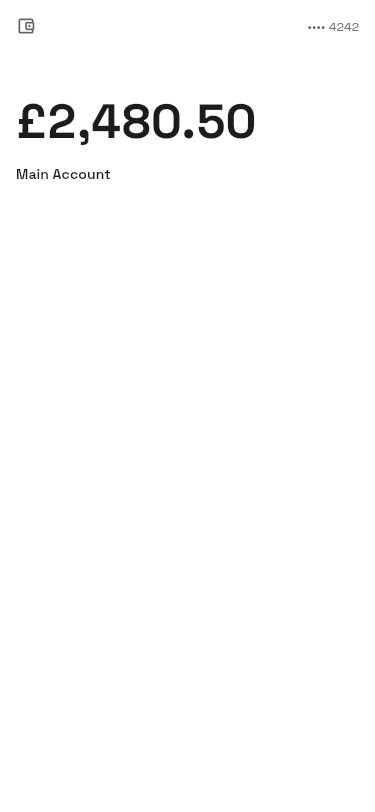

| Parameter | Type | Required | Default | Description |
|-----------|------|----------|---------|-------------|
| account | `BankAccount` | ✓ | — | The account data to display. |
| onTap | `VoidCallback?` | — | — | Called when the card is tapped; no tap interaction when null. |
| onLongPress | `VoidCallback?` | — | — | Called on long-press, e.g. to show a context menu. |
| itemBuilder | `Widget Function(BuildContext, BankAccount)?` | — | — | When non-null, completely overrides the default card content. |
| showFullBalance | `bool` | — | `true` | True uses hero balance size; false uses large (compact mode). |
| actions | `Widget?` | — | — | Optional widget rendered at the bottom of the card below the account-name/status row. |

#### BankAccountSwitcher

Bottom-sheet or inline widget for selecting among multiple bank accounts, respecting privacy mode and optionally presented as a modal via `BankAccountSwitcher.show`.

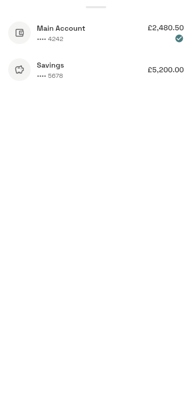

| Parameter | Type | Required | Default | Description |
|-----------|------|----------|---------|-------------|
| accounts | `List<BankAccount>` | ✓ | — | The list of accounts to display. |
| onSelected | `ValueChanged<BankAccount>` | ✓ | — | Called when the user taps a row; wired to `Navigator.pop(account)` in sheet flow. |
| selectedAccountId | `String?` | — | — | The ID of the currently active account; its row receives a trailing checkmark. |
| itemBuilder | `Widget Function(BuildContext, BankAccount, bool isSelected)?` | — | — | Optional full override for each row while retaining built-in search and filtering. |

---

### Cards

#### BankFlipCard

A generic 3-D flip-card container that wraps any front/back widget pair in a smooth perspective-flip animation.

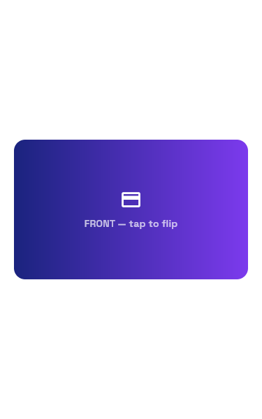

| Parameter | Type | Required | Default | Description |
|-----------|------|----------|---------|-------------|
| frontBuilder | `Widget Function(BuildContext, bool)` | ✓ | — | Builds the front face; receives context and whether the card is currently showing the back. |
| backBuilder | `Widget Function(BuildContext, bool)` | ✓ | — | Builds the back face; receives context and whether the card is currently showing the back. |
| isFlipped | `bool?` | — | — | When non-null, the card is controlled by the host; pair with `onFlip`. |
| onFlip | `VoidCallback?` | — | — | Called when the flip trigger fires; required to toggle state when `isFlipped` is provided. |
| trigger | `BankFlipTrigger` (`tapToFlip` · `builtInButton` · `external`) | — | `BankFlipTrigger.tapToFlip` | What causes the flip. |
| flipButtonBuilder | `Widget Function(BuildContext, VoidCallback)?` | — | — | Replaces the default icon-button when trigger is `builtInButton`. |
| flipDuration | `Duration` | — | `Duration(milliseconds: 500)` | Duration of the flip animation. |
| flipCurve | `Curve` | — | `Curves.easeInOutCubic` | Curve applied to the flip animation. |
| flipAxis | `BankFlipAxis` (`horizontal` · `vertical`) | — | `BankFlipAxis.horizontal` | The rotation axis. |
| width | `double` | — | `340` | Card width in logical pixels. |
| height | `double` | — | `200` | Card height in logical pixels. |

#### BankHorizontalAccountCard

A landscape-format bank account card with a built-in 3-D flip animation showing account name, balance, and masked number on the front and full account details on the back.

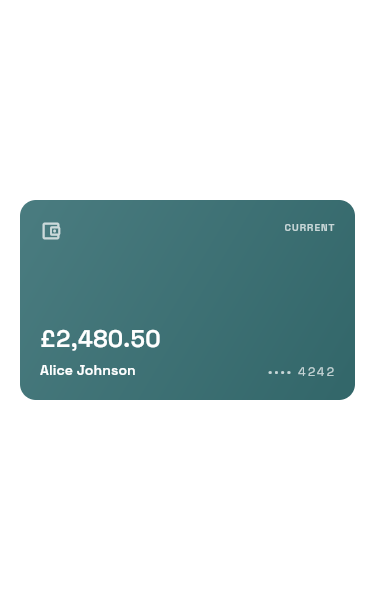

| Parameter | Type | Required | Default | Description |
|-----------|------|----------|---------|-------------|
| account | `BankAccount` | ✓ | — | The account whose data is displayed. |
| cardholderName | `String?` | — | — | Cardholder name shown on front and back; defaults to `BankAccount.name`. |
| background | `BankHorizontalCardBackground` (`themeGradient` · `solidColor` · `image`) | — | `BankHorizontalCardBackground.themeGradient` | Which background mode to apply. |
| primaryColor | `Color?` | — | — | Primary card colour for solid and gradient modes; falls back to `BankThemeData.primary`. |
| secondaryColor | `Color?` | — | — | Second gradient stop; falls back to `BankThemeData.primaryVariant`. |
| backgroundImage | `ImageProvider?` | — | — | Image provider used when background is `image` mode. |
| backgroundImageFit | `BoxFit` | — | `BoxFit.cover` | How the background image is fitted in `image` mode. |
| backgroundImageOverlay | `Color?` | — | — | Optional colour overlay blended on top of the background image to keep text readable. |
| layout | `BankHorizontalCardLayout` (`balanceLeft` · `centred` · `balanceBottom`) | — | `BankHorizontalCardLayout.balanceLeft` | Field arrangement on the front face. |
| networkLogoAsset | `String?` | — | — | Asset path for the card-network logo. |
| trigger | `BankFlipTrigger` (`tapToFlip` · `builtInButton` · `external`) | — | `BankFlipTrigger.tapToFlip` | How the flip is triggered. |
| flipButtonBuilder | `Widget Function(BuildContext, VoidCallback)?` | — | — | Replaces the default flip button when trigger is `builtInButton`. |
| isFlipped | `bool?` | — | — | External flip state; pair with `onFlip` to control from outside. |
| onFlip | `VoidCallback?` | — | — | Called when the flip trigger fires; required when `isFlipped` is provided. |
| flipDuration | `Duration` | — | `Duration(milliseconds: 500)` | Duration of the flip animation. |
| flipCurve | `Curve` | — | `Curves.easeInOutCubic` | Curve of the flip animation. |
| flipAxis | `BankFlipAxis` (`horizontal` · `vertical`) | — | `BankFlipAxis.horizontal` | Axis of rotation. |
| width | `double` | — | `340` | Card width in logical pixels. |
| height | `double` | — | `200` | Card height in logical pixels. |

#### BankVirtualCardWidget

Realistic virtual card with front/back flip animation, supporting multiple surface treatments and a frozen-state frost overlay.

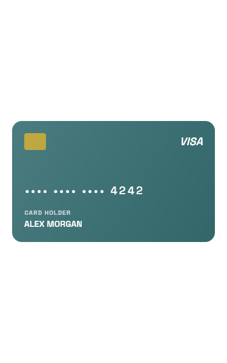

| Parameter | Type | Required | Default | Description |
|-----------|------|----------|---------|-------------|
| account | `BankAccount` | ✓ | — | The account whose data is displayed on the card. |
| surface | `BankCardSurface` (`flatColor` · `gradient` · `animatedMesh` · `metallicSweep`) | — | `BankCardSurface.gradient` | The visual surface treatment applied to the card. |
| cardState | `BankCardState` (`normal` · `frozen`) | — | `BankCardState.normal` | Whether the card is normal or frozen (shows a frost overlay). |
| primaryColor | `Color?` | — | — | Solid colour for `flatColor` surface and gradient base; falls back to `BankThemeData.primary`. |
| secondaryColor | `Color?` | — | — | Second gradient stop; falls back to `BankThemeData.primaryVariant`. |
| backgroundImage | `ImageProvider?` | — | — | When set, replaces the surface decoration with this image. |
| backgroundImageFit | `BoxFit` | — | `BoxFit.cover` | How the background image is fitted within the card. |
| backgroundImageOverlay | `Color?` | — | — | Colour blended over the background image to keep text legible. |
| networkLogoAsset | `String?` | — | — | Asset path for the card-network logo rendered on the front face. |
| bankLogoAsset | `String?` | — | — | Asset path for the bank logo shown on the back face. |
| cardholderName | `String?` | — | — | Cardholder name displayed on front and back; defaults to `account.name`. |
| expiryDate | `String?` | — | — | Expiry date string in `MM/YY` format shown on the front face. |
| isFlipped | `bool` | — | `false` | Whether the card is currently showing its back face. |
| onFlip | `VoidCallback?` | — | — | Invoked when the flip trigger fires; host should toggle `isFlipped` here. |
| flipTrigger | `BankFlipTrigger` (`tapToFlip` · `builtInButton` · `external`) | — | `BankFlipTrigger.tapToFlip` | How the flip is triggered. |
| flipButtonBuilder | `Widget Function(BuildContext, VoidCallback)?` | — | — | Replaces the default icon-button when `flipTrigger` is `builtInButton`. |
| width | `double` | — | `340` | Card width in logical pixels. |
| height | `double` | — | `200` | Card height in logical pixels. |

#### BankCardControlsPanel

Panel of toggles and controls for managing a payment card, including freeze, online payments, contactless, international toggles, an optional spend-limit slider, and action rows for PIN change and reporting lost/stolen.

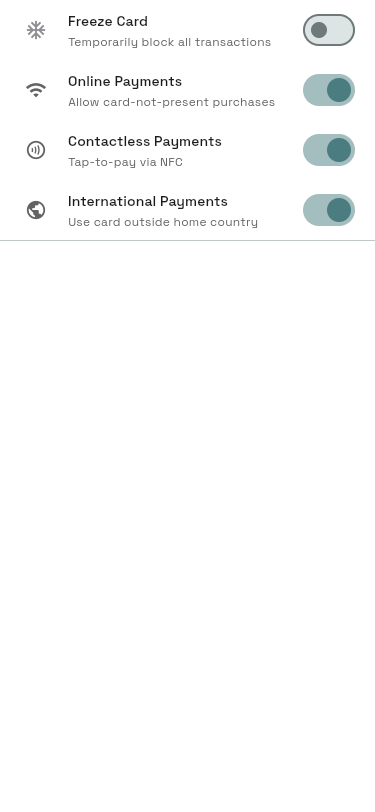

| Parameter | Type | Required | Default | Description |
|-----------|------|----------|---------|-------------|
| isFrozen | `bool` | ✓ | — | Whether the card freeze toggle is currently enabled. |
| isOnlinePaymentsEnabled | `bool` | ✓ | — | Whether the online payments toggle is currently enabled. |
| isContactlessEnabled | `bool` | ✓ | — | Whether the contactless payments toggle is currently enabled. |
| isInternationalEnabled | `bool` | ✓ | — | Whether the international payments toggle is currently enabled. |
| onFreezeChanged | `ValueChanged<bool>` | ✓ | — | Callback invoked when the freeze toggle changes. |
| onOnlinePaymentsChanged | `ValueChanged<bool>` | ✓ | — | Callback invoked when the online payments toggle changes. |
| onContactlessChanged | `ValueChanged<bool>` | ✓ | — | Callback invoked when the contactless toggle changes. |
| onInternationalChanged | `ValueChanged<bool>` | ✓ | — | Callback invoked when the international payments toggle changes. |
| spendLimit | `double?` | — | — | Current spend-limit value; null means no limit is set. |
| maxSpendLimit | `double` | — | `10000` | Maximum value for the spend-limit slider. |
| onSpendLimitChanged | `ValueChanged<double>?` | — | — | When non-null, a spend-limit slider is shown below the toggles. |
| onChangePinTap | `VoidCallback?` | — | — | Called when the user taps "Change PIN". |
| onReportLostOrStolen | `VoidCallback?` | — | — | Called when the user taps "Report Lost or Stolen". |

#### BankCardPinManager

Three-step Change-PIN flow widget: verify current PIN, enter new PIN, and confirm new PIN, calling `onSubmit` with `(currentPin, newPin)` on completion.

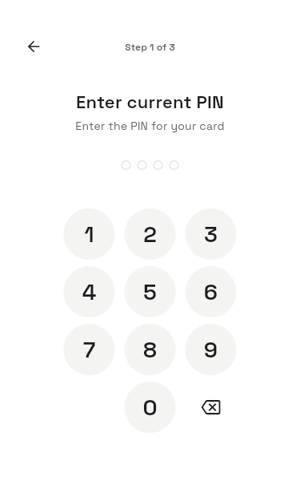

| Parameter | Type | Required | Default | Description |
|-----------|------|----------|---------|-------------|
| onSubmit | `Future<bool> Function(String currentPin, String newPin)` | ✓ | — | Async handler receiving the current and new PIN; return true on success, false on failure. |
| pinLength | `int` | — | `4` | Number of digits in the PIN (typically 4 or 6). |
| onCancel | `VoidCallback?` | — | — | Called when the user dismisses the flow without completing it. |
| onSuccess | `VoidCallback?` | — | — | Called after a successful `onSubmit` response. |

#### BankPhysicalCardMaterialPicker

Horizontal card-design picker for the order-a-card flow, displaying each `BankCardDesignOption` as a mini card preview with a material badge and selection ring.

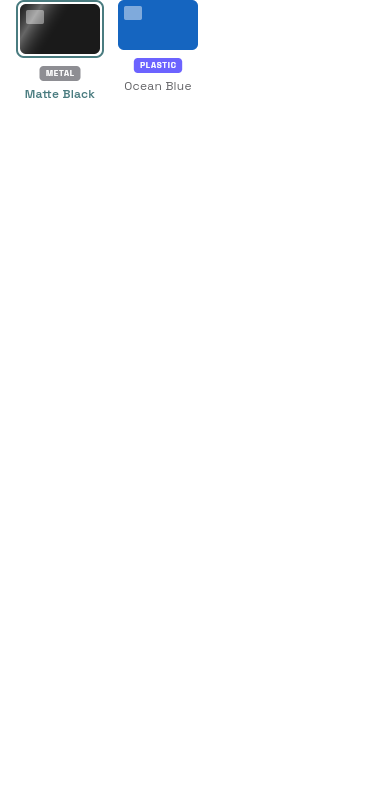

| Parameter | Type | Required | Default | Description |
|-----------|------|----------|---------|-------------|
| options | `List<BankCardDesignOption>` | ✓ | — | The list of card design options to display. |
| onSelected | `ValueChanged<BankCardDesignOption>` | ✓ | — | Called when the user taps a card design option. |
| selectedId | `String?` | — | — | The ID of the currently selected option; ringed in the theme primary colour. |

---

### Transactions

#### BankTransactionListTile

A single transaction row, designed for use inside `ListView.builder`, showing category icon with optional merchant logo, signed amount, and status.

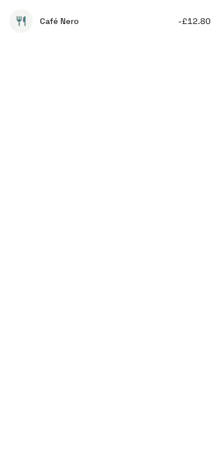

| Parameter | Type | Required | Default | Description |
|-----------|------|----------|---------|-------------|
| transaction | `Transaction` | ✓ | — | The transaction data to display. |
| onTap | `VoidCallback?` | — | — | Optional tap callback; makes the tile interactive. |
| itemBuilder | `Widget Function(BuildContext, Transaction)?` | — | — | Full override — replaces the default tile layout entirely when provided. |

#### BankTransactionGroupHeader

Sticky date-grouped section header for transaction lists, with "Today" and "Yesterday" labels sourced from `BankUiStrings`.

| Parameter | Type | Required | Default | Description |
|-----------|------|----------|---------|-------------|
| date | `DateTime` | ✓ | — | The date this group header represents. |
| strings | `BankUiStrings?` | — | — | Optional strings override; falls back to `BankUiScope.of(context).strings`. |

#### BankTransactionDetailSheet

Full-detail bottom sheet for a single transaction, showing merchant info, amount, date, category, status, optional map preview, category splits, and action buttons.

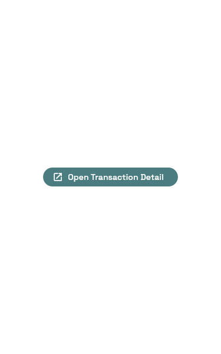

| Parameter | Type | Required | Default | Description |
|-----------|------|----------|---------|-------------|
| transaction | `Transaction` | ✓ | — | The transaction whose details are displayed. |
| mapPreview | `Widget?` | — | — | Optional map widget supplied by the host app (e.g. a Google Maps snippet). |
| onDispute | `VoidCallback?` | — | — | Callback invoked when the user taps the Dispute action button. |
| onShare | `VoidCallback?` | — | — | Callback invoked when the user taps the Share action button. |

#### BankTransactionFilterSheet

Stateful bottom sheet with category chip filters, date-range pickers, and min/max amount inputs for filtering transaction lists.

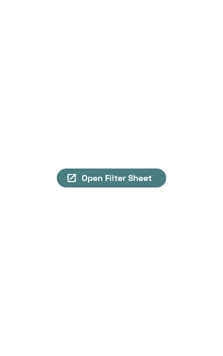

| Parameter | Type | Required | Default | Description |
|-----------|------|----------|---------|-------------|
| onApply | `ValueChanged<BankTransactionFilter>` | ✓ | — | Called with the resulting filter when the user taps Apply. |
| initial | `BankTransactionFilter?` | — | — | Pre-populate the sheet with an existing filter state. |
| onClear | `VoidCallback?` | — | — | Optional callback invoked after the user taps Clear All. |

#### BankReceiptView

Shareable receipt layout with merchant name, formatted amount, transaction metadata, a dashed-divider perforated-edge effect, QR placeholder, and optional export button; wrap in `RepaintBoundary` for PDF export.

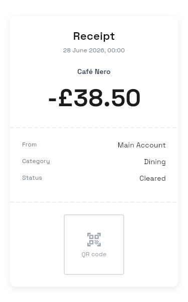

| Parameter | Type | Required | Default | Description |
|-----------|------|----------|---------|-------------|
| transaction | `Transaction` | ✓ | — | The transaction to render as a receipt. |
| fromAccountName | `String?` | — | — | Sender account name shown in the receipt body. |
| toName | `String?` | — | — | Recipient name shown in the receipt body. |
| referenceNumber | `String?` | — | — | Reference number displayed in the receipt body. |
| onExport | `VoidCallback?` | — | — | Callback invoked when the user taps Export Receipt; omit to hide the button. |
| logoSlot | `Widget?` | — | — | Optional brand logo widget shown at the top of the receipt. |

#### BankTransactionCostSplitSheet

Stateful bottom sheet for splitting the cost of a single transaction between multiple people, supporting equal-split and custom-amount modes.

| Parameter | Type | Required | Default | Description |
|-----------|------|----------|---------|-------------|
| transaction | `Transaction` | ✓ | — | The transaction whose total is being split. |
| participants | `List<BankSplitParticipant>` | ✓ | — | The list of people who can receive a share of the cost. |
| onConfirm | `ValueChanged<Map<String, Money>>` | ✓ | — | Called when the user confirms; maps participantId to the allocated Money amount. |

#### BankTransactionCategorySplitSheet

Stateful bottom sheet for splitting a single transaction's amount across multiple spending categories, with per-row category dropdowns and amount inputs.

| Parameter | Type | Required | Default | Description |
|-----------|------|----------|---------|-------------|
| transaction | `Transaction` | ✓ | — | The transaction whose amount is being allocated across categories. |
| onConfirm | `ValueChanged<List<TransactionSplit>>` | ✓ | — | Called with the list of category splits when the user confirms. |

---

### Transfers & Payments

#### BankAmountKeypad

Large numeric keypad tuned for currency input where the host app owns the amount string and digit/delete events are surfaced via callbacks.

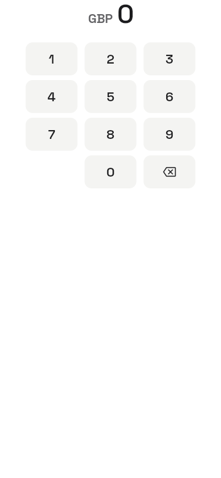

| Parameter | Type | Required | Default | Description |
|-----------|------|----------|---------|-------------|
| amountText | `String` | ✓ | — | Current formatted amount string shown in the display area. |
| currencyCode | `String` | ✓ | — | ISO 4217 currency code, e.g. `GBP`, `USD`. |
| onDigit | `ValueChanged<String>` | ✓ | — | Called with `'0'`–`'9'` when the user taps a digit key. |
| onDelete | `VoidCallback` | ✓ | — | Called when the user taps the delete/backspace key. |
| onDecimalPoint | `VoidCallback?` | — | — | When non-null, the decimal-point key is active and this callback is invoked on tap. |
| numeralStyle | `NumeralStyle` (`western` · `arabic` · `persian`) | — | `NumeralStyle.western` | Numeral script used when displaying the amount. |
| maxAmount | `double?` | — | — | When the parsed amount meets or exceeds this value, digit keys are rendered at reduced opacity. |
| enabled | `bool` | — | `true` | When false, the entire keypad is rendered at 40% opacity and does not respond to gestures. |

#### BankBeneficiaryPicker

Saved-beneficiaries list with a search bar, an optional add-new entry point, and a filtered list of `BankBeneficiary` rows with the selected one highlighted by a trailing checkmark.

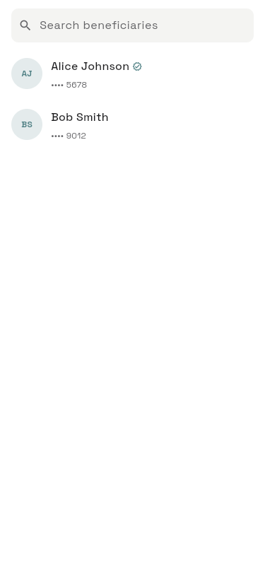

| Parameter | Type | Required | Default | Description |
|-----------|------|----------|---------|-------------|
| beneficiaries | `List<BankBeneficiary>` | ✓ | — | Full list of beneficiaries to display before any search query is applied. |
| onSelected | `ValueChanged<BankBeneficiary>` | ✓ | — | Called when the user taps a beneficiary row. |
| selectedId | `String?` | — | — | The ID of the currently selected beneficiary, or null if none is selected. |
| onAddNew | `VoidCallback?` | — | — | When non-null, an "Add new beneficiary" row is shown at the top of the list. |
| itemBuilder | `Widget Function(BuildContext, BankBeneficiary, bool isSelected)?` | — | — | Optional builder that completely replaces the default row for each beneficiary. |

#### BankTransferReviewCard

Confirm-before-send summary card displaying beneficiary, amount, fee, optional exchange rate, estimated arrival time, and an optional additional-info slot.

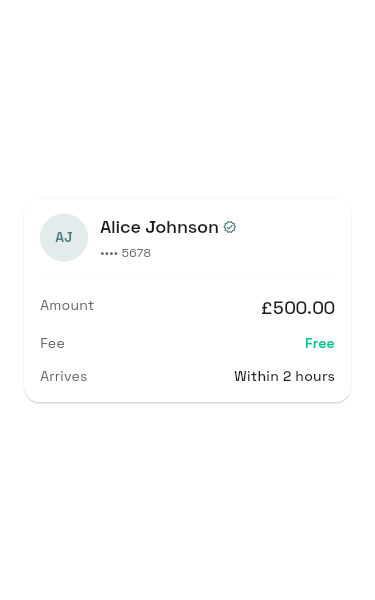

| Parameter | Type | Required | Default | Description |
|-----------|------|----------|---------|-------------|
| amount | `Money` | ✓ | — | The amount being sent. |
| beneficiary | `BankBeneficiary` | ✓ | — | The beneficiary receiving the transfer. |
| fee | `Money?` | — | — | Transfer fee; pass null or a zero Money to show "Free". |
| exchangeRate | `ExchangeRate?` | — | — | Exchange rate for international transfers; adds "You send" and "They receive" rows when non-null. |
| estimatedArrival | `String?` | — | — | Human-readable estimated arrival string; ignored when `isScheduled` is true. |
| isScheduled | `bool` | — | `false` | When true, the arrival row displays the scheduled date instead of `estimatedArrival`. |
| scheduledDate | `DateTime?` | — | — | The date the transfer is scheduled for; only used when `isScheduled` is true. |
| additionalInfo | `Widget?` | — | — | Optional widget rendered below the summary rows for disclaimers or T&C links. |

#### BankPaymentRequestCard

Incoming money-request card with accept or decline actions.

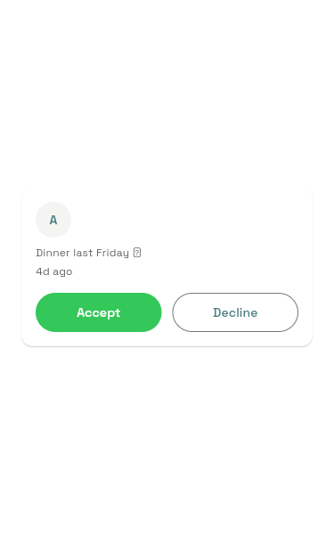

| Parameter | Type | Required | Default | Description |
|-----------|------|----------|---------|-------------|
| requesterId | `String` | ✓ | — | Unique identifier of the requester. |
| requesterName | `String` | ✓ | — | Display name of the requester shown in the card header. |
| amount | `Money` | ✓ | — | The amount of money being requested. |
| requestedAt | `DateTime` | ✓ | — | Timestamp of when the request was made; displayed as a relative time-ago string. |
| onAccept | `VoidCallback` | ✓ | — | Called when the user taps the Accept button. |
| onDecline | `VoidCallback` | ✓ | — | Called when the user taps the Decline button. |
| requesterAvatarUrl | `String?` | — | — | Optional network URL for the requester's avatar image. |
| note | `String?` | — | — | Optional note attached to the payment request. |

#### BankScheduledTransferToggle

Instant / Later / Recurring segmented selector for a transfer, with an optional date-and-time picker row for "Later" and a recurrence pattern dropdown for "Recurring".

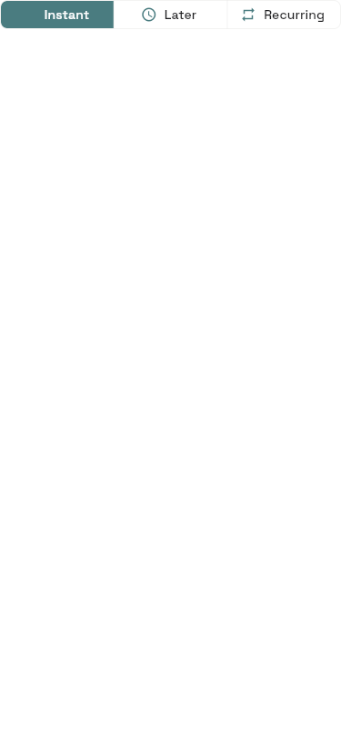

| Parameter | Type | Required | Default | Description |
|-----------|------|----------|---------|-------------|
| selected | `BankTransferTiming` (`instant` · `later` · `recurring`) | ✓ | — | The currently selected transfer timing value. |
| onChanged | `ValueChanged<BankTransferTiming>` | ✓ | — | Called when the user taps a different segment. |
| scheduledDate | `DateTime?` | — | — | The currently selected scheduled date for `later` timing. |
| onDateChanged | `ValueChanged<DateTime>?` | — | — | When non-null and `later` is selected, a date-and-time picker row is rendered. |
| recurringPattern | `String?` | — | — | The currently selected recurrence pattern, e.g. `'Weekly'` or `'Monthly'`. |
| onRecurringPatternChanged | `ValueChanged<String>?` | — | — | When non-null and `recurring` is selected, a pattern dropdown is rendered. |

#### BankTransactionPinSheet

Transfer-specific authorisation PIN bottom sheet with a configurable title, subtitle, and `onSubmit` callback that returns true on success or shows a shake error on failure.

| Parameter | Type | Required | Default | Description |
|-----------|------|----------|---------|-------------|
| onSubmit | `Future<bool> Function(String pin)` | ✓ | — | Called with the entered PIN when all digits have been entered; return true to close, false to show shake error. |
| pinLength | `int` | — | `6` | Number of PIN digits expected. |
| onCancel | `VoidCallback?` | — | — | Called when the user taps the cancel button; defaults to `Navigator.pop` when null. |
| title | `String` | — | `'Enter PIN'` | Sheet title displayed at the top. |
| subtitle | `String` | — | `'Enter your PIN to confirm this transfer'` | Subtitle shown below the title to clarify the authorisation context. |

#### BankTransferResultScreen

Full-screen success or failure state shown after a transfer completes, playing a success animation with confetti on success or a red error icon on failure.

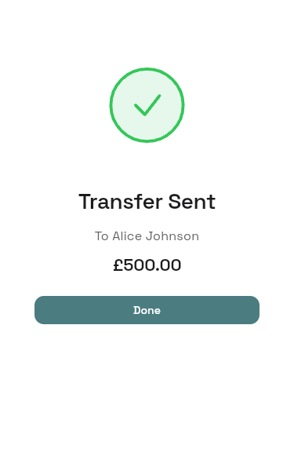

| Parameter | Type | Required | Default | Description |
|-----------|------|----------|---------|-------------|
| isSuccess | `bool` | ✓ | — | `true` for a success state; `false` for a failure state. |
| onDone | `VoidCallback` | ✓ | — | Called when the primary "Done" button is tapped. |
| amount | `Money?` | — | — | The amount transferred; shown below the animation on success. |
| beneficiaryName | `String?` | — | — | Name of the beneficiary who received the transfer; shown on success. |
| referenceNumber | `String?` | — | — | Reference number for the transfer; shown in selectable style on success. |
| failureReason | `String?` | — | — | Human-readable failure reason shown on the failure state. |
| onShareReceipt | `VoidCallback?` | — | — | When non-null, a secondary "Share Receipt" button is shown (success only). |
| onNewTransfer | `VoidCallback?` | — | — | When non-null, a secondary "New Transfer" button is shown (success only). |

#### BankContactPaymentSheet

Three-step modal sheet for picking a contact, entering an amount with an optional note, and confirming a send or request payment action.

| Parameter | Type | Required | Default | Description |
|-----------|------|----------|---------|-------------|
| contacts | `List<BankSplitParticipant>` | ✓ | — | Contacts available for selection in the contact picker step. |
| onClose | `VoidCallback?` | — | — | Called when the sheet is closed via its own close button; defaults to `Navigator.pop` when null. |
| onSend | `Future<void> Function(String contactId, Money amount, String? note)?` | — | — | Called when the user confirms a Send action; throw on failure. |
| onRequest | `Future<void> Function(String contactId, Money amount, String? note)?` | — | — | Called when the user confirms a Request action; throw on failure. |

---

### Auth & Security

#### BankPinKeypad

Numeric keypad for PIN entry that exposes `onDigit` and `onDelete` callbacks so the host app fully owns the PIN string state.

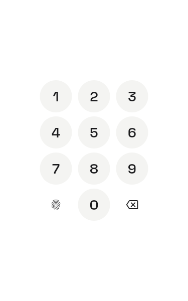

| Parameter | Type | Required | Default | Description |
|-----------|------|----------|---------|-------------|
| onDigit | `ValueChanged<String>` | ✓ | — | Called when the user taps a digit key; receives the digit as a string (`'0'`–`'9'`). |
| onDelete | `VoidCallback` | ✓ | — | Called when the user taps the delete (backspace) key. |
| onBiometric | `VoidCallback?` | — | — | When non-null, a fingerprint icon button is shown in the bottom-left and this callback is invoked on tap. |
| enabled | `bool` | — | `true` | When false, all keys are rendered at 40% opacity and do not respond to gestures. |
| digitBuilder | `Widget Function(BuildContext, String)?` | — | — | Optional builder for digit cells; replaces the default Text-based rendering. |

#### BankPinDots

Displays filled/empty dot indicators for a PIN entry sequence, and plays a shake animation when an error state is triggered.

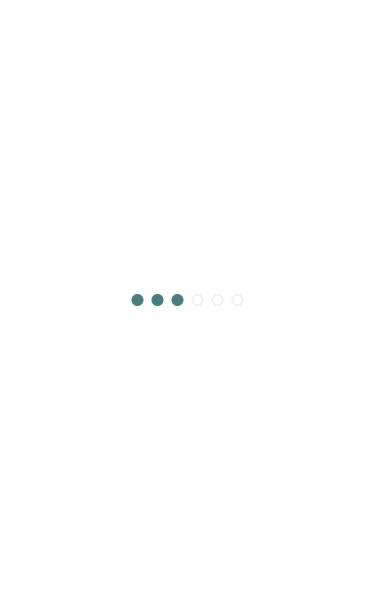

| Parameter | Type | Required | Default | Description |
|-----------|------|----------|---------|-------------|
| filled | `int` | ✓ | — | Number of digits entered so far; clamped internally to `[0, length]`. |
| length | `int` | — | `6` | Total expected PIN length; must be greater than 0. |
| obscure | `bool` | — | `true` | When true, dots are drawn as solid circles. |
| error | `bool` | — | `false` | When flipped to true, the dot row plays a horizontal shake animation to indicate an incorrect PIN. |
| filledColor | `Color?` | — | — | Override colour for filled dots; defaults to `BankThemeData.primary`. |
| emptyColor | `Color?` | — | — | Override colour for empty dots; defaults to `BankThemeData.outline`. |
| dotSize | `double` | — | `12` | Diameter of each dot in logical pixels. |

#### BankBiometricPromptButton

A tappable button that triggers an injected biometric authentication callback and reflects its outcome (idle, loading, success, error) visually.

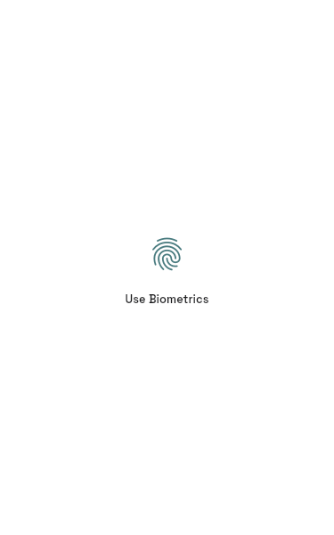

| Parameter | Type | Required | Default | Description |
|-----------|------|----------|---------|-------------|
| onAuthenticate | `Future<bool> Function()` | ✓ | — | Called when the button is tapped; must return true on success and false (or throw) on failure. |
| onSuccess | `VoidCallback?` | — | — | Called after a successful authentication and a brief checkmark display. |
| onError | `ValueChanged<String>?` | — | — | Called with an error message when `onAuthenticate` returns false. |
| label | `String` | — | `'Use Biometrics'` | Button label displayed below the icon. |
| type | `BankBiometricType` (`fingerprint` · `face`) | — | `BankBiometricType.fingerprint` | Determines the icon displayed. |

#### BankPrivacyToggle

A tappable icon button that toggles the ambient `BankUiScope` privacy state, supporting both uncontrolled and controlled modes.

| Parameter | Type | Required | Default | Description |
|-----------|------|----------|---------|-------------|
| overrideValue | `bool?` | — | — | When non-null, the widget operates in controlled mode and this value determines which icon is displayed. |
| onChanged | `ValueChanged<bool>?` | — | — | Called in controlled mode when the button is tapped; receives the new desired privacy state. |

#### BankDeviceTrustBanner

A contextual security banner driven by an externally-supplied state flag, rendering either a new-device (amber) or compromised-device (red) warning with optional dismiss and learn-more actions.

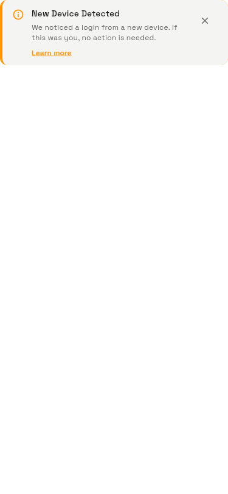

| Parameter | Type | Required | Default | Description |
|-----------|------|----------|---------|-------------|
| state | `BankDeviceTrustState` (`newDevice` · `compromised`) | ✓ | — | The security classification that determines copy, colour, and icon. |
| onDismiss | `VoidCallback?` | — | — | When non-null, an × dismiss button is shown on the trailing edge. |
| onLearnMore | `VoidCallback?` | — | — | When non-null, a "Learn more" text button is shown below the body text. |
| strings | `BankUiStrings?` | — | — | Optional override for localised strings; falls back to `BankUiScope.of(context).strings` when null. |

#### BankSessionTimeoutDialog

A modal dialog that counts down from `remainingTime` and fires `onLogout` when the countdown reaches zero, with a primary "stay logged in" action.

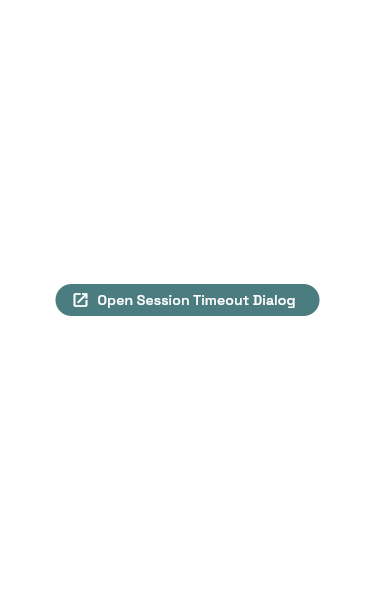

| Parameter | Type | Required | Default | Description |
|-----------|------|----------|---------|-------------|
| remainingTime | `Duration` | ✓ | — | How much time remains before the session expires; the countdown decrements by one second every tick. |
| onExtend | `VoidCallback` | ✓ | — | Called when the user taps the primary action ("Stay Logged In"); host is responsible for resetting session timers. |
| onLogout | `VoidCallback` | ✓ | — | Called when the user taps "Log Out" or when the countdown reaches zero. |
| title | `String` | — | `'Session Expiring'` | Dialog title. |
| body | `String` | — | `'Your session will expire soon. Stay logged in?'` | Dialog body text shown above the countdown. |
| extendLabel | `String` | — | `'Stay Logged In'` | Label for the primary (extend) button. |
| logoutLabel | `String` | — | `'Log Out'` | Label for the secondary (logout) button. |

#### BankAppSwitcherPrivacyOverlay

Blurs or redacts sensitive content when the app loses foreground focus (e.g. when the system app-switcher is open), activating on `AppLifecycleState.inactive` or `paused`.

| Parameter | Type | Required | Default | Description |
|-----------|------|----------|---------|-------------|
| child | `Widget` | ✓ | — | The widget tree to protect. |
| enabled | `bool` | — | `true` | Whether the overlay is active; set to false to disable without removing the widget from the tree. |
| placeholder | `Widget?` | — | — | When non-null, replaces the child entirely when the overlay is active; otherwise a blurred-and-dimmed version is shown. |

---

### States & Feedback

#### BankSkeletonLoader

Shimmer-effect placeholder that takes the shape of common Bank UI Kit cards while data loads.

| Parameter | Type | Required | Default | Description |
|-----------|------|----------|---------|-------------|
| variant | `BankSkeletonVariant` (`accountCard` · `transactionTile` · `potCard` · `generic`) | — | `BankSkeletonVariant.generic` | Which card shape to mimic. |
| count | `int` | — | `1` | How many tiles to show stacked vertically; must be at least 1. |
| width | `double?` | — | — | Explicit width for the `generic` variant; defaults to `double.infinity`. |
| height | `double?` | — | — | Explicit height for the `generic` variant; defaults to 80. |

#### BankEmptyStateView

Full-viewport empty-state widget displaying an optional illustration, a required title, an optional subtitle, and an optional call-to-action button.

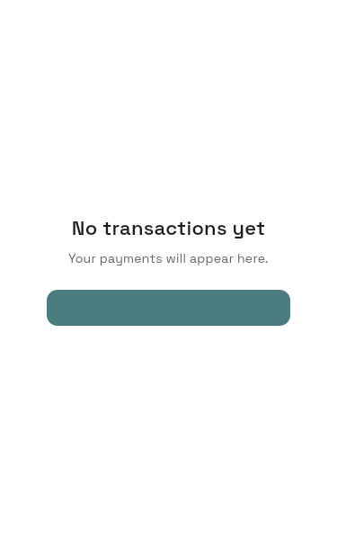

| Parameter | Type | Required | Default | Description |
|-----------|------|----------|---------|-------------|
| title | `String` | ✓ | — | Short descriptive title. |
| illustration | `Widget?` | — | — | Optional illustration widget placed above the title; constrained to a maximum height of 180 px. |
| subtitle | `String?` | — | — | Optional supporting sentence beneath the title. |
| actionLabel | `String?` | — | — | Label for the call-to-action button; only shown when `onAction` is also non-null. |
| onAction | `VoidCallback?` | — | — | Callback invoked when the call-to-action button is tapped. |

#### BankErrorStateView

Error state widget that requires a specific title and message and provides optional retry and contact-support action buttons.

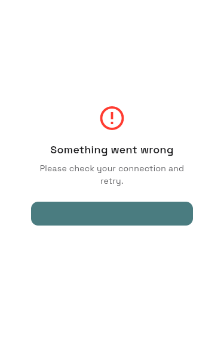

| Parameter | Type | Required | Default | Description |
|-----------|------|----------|---------|-------------|
| title | `String` | ✓ | — | Short title describing what went wrong. |
| message | `String` | ✓ | — | A specific explanation of the error — never a generic fallback. |
| retryLabel | `String` | — | `'Retry'` | Label for the retry action button. |
| supportLabel | `String?` | — | — | Label for the support action button; defaults to "Contact Support" when omitted. |
| onRetry | `VoidCallback?` | — | — | Callback for the retry button; button is omitted when null. |
| onContactSupport | `VoidCallback?` | — | — | Callback for the contact-support button; button is omitted when null. |
| icon | `Widget?` | — | — | Custom icon widget; defaults to `Icons.error_outline` in danger colour at 48 px. |

#### BankSuccessAnimation

Lightweight success micro-animation that plays a three-phase circle-draw, checkmark-draw, and scale-bounce sequence with optional confetti.

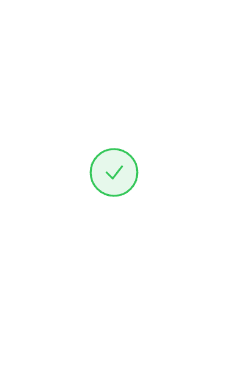

| Parameter | Type | Required | Default | Description |
|-----------|------|----------|---------|-------------|
| size | `double` | — | `80` | Diameter of the circle and checkmark in logical pixels; must be positive. |
| color | `Color?` | — | — | Stroke colour; defaults to `BankTokens.success`. |
| showConfetti | `bool` | — | `false` | When true, twelve confetti particles burst outward after the main animation completes. |
| onComplete | `VoidCallback?` | — | — | Called once the main animation (and confetti, if enabled) finishes. |
| label | `Widget?` | — | — | Optional label widget placed below the animation. |

#### BankToastBanner

A toast-style banner that slides in from the top of its parent, auto-hides after a configurable duration, and is controlled by the host via an `isVisible` flag.

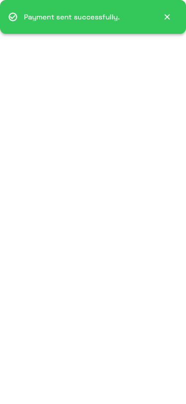

| Parameter | Type | Required | Default | Description |
|-----------|------|----------|---------|-------------|
| variant | `BankToastVariant` (`success` · `error` · `info` · `warning`) | ✓ | — | Visual variant that determines the background colour and leading icon. |
| message | `String` | ✓ | — | The message text displayed in the banner. |
| isVisible | `bool` | ✓ | — | Whether the banner is currently visible; toggling this drives the slide animation. |
| actionLabel | `String?` | — | — | Optional label for an action button inside the banner. |
| onAction | `VoidCallback?` | — | — | Callback invoked when the action button is tapped. |
| onDismiss | `VoidCallback?` | — | — | Callback invoked when the banner should be dismissed; host must set `isVisible` to false. |
| autoHideDuration | `Duration` | — | `Duration(seconds: 4)` | How long to wait before auto-dismissing the banner. |
| hapticFeedback | `bool` | — | `true` | When true, calls `HapticFeedback.lightImpact()` when the banner appears. |

#### BankFraudAlertBanner

High-priority fraud warning banner with a danger-coloured left border that deliberately resists accidental dismissal by making the primary security action the prominent call to act.

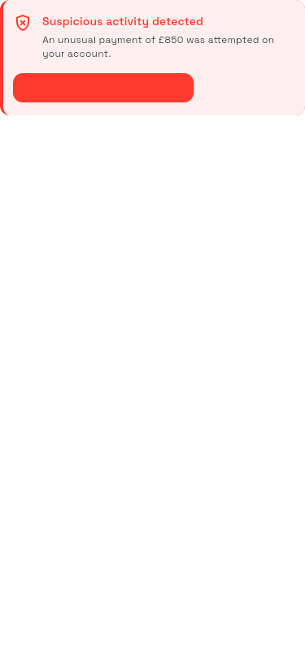

| Parameter | Type | Required | Default | Description |
|-----------|------|----------|---------|-------------|
| title | `String` | ✓ | — | Short title summarising the security event. |
| body | `String` | ✓ | — | Detailed description of the suspected fraud. |
| primaryActionLabel | `String` | ✓ | — | Label for the primary action button (e.g. "Secure My Account"). |
| dismissLabel | `String` | ✓ | — | Label for the dismiss action button. |
| onPrimaryAction | `VoidCallback` | ✓ | — | Called when the user taps the primary action button. |
| onDismiss | `VoidCallback` | ✓ | — | Called when the user explicitly taps the dismiss button. |

---

### Insights

#### BankSpendingBreakdownChart

Donut chart showing spending split by category, with an animated entry and a tappable legend.

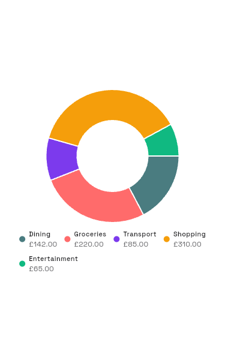

| Parameter | Type | Required | Default | Description |
|-----------|------|----------|---------|-------------|
| categories | `List<BankSpendingCategory>` | ✓ | — | List of spending category entries, each with a `TransactionCategory`, `Money` amount, and optional colour. |
| centerLabel | `String?` | — | — | Optional label displayed in the centre of the donut chart. |

#### BankBudgetGaugeWidget

Shows a budget's progress with an animated bar and over-budget warning.

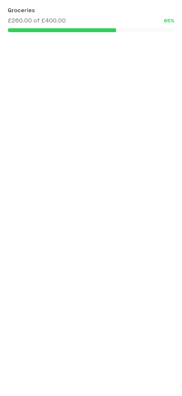

| Parameter | Type | Required | Default | Description |
|-----------|------|----------|---------|-------------|
| budget | `BankBudget` | ✓ | — | The budget model containing name, limit, spent amounts, and period dates. |
| onTap | `VoidCallback?` | — | — | Optional callback invoked when the gauge row is tapped. |

#### BankInsightCard

A swipeable AI-generated insight card with confidence indicator.

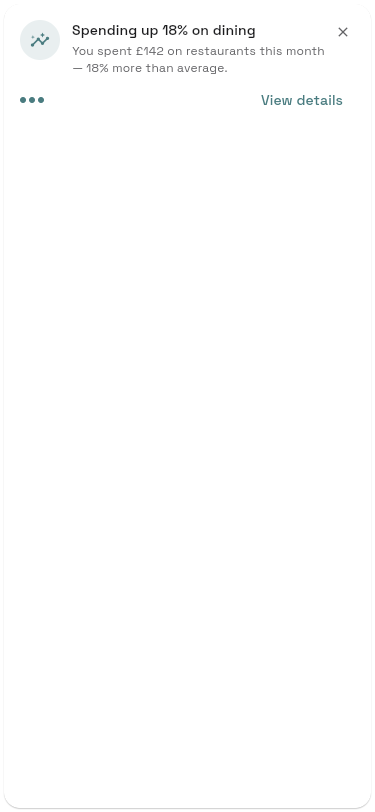

| Parameter | Type | Required | Default | Description |
|-----------|------|----------|---------|-------------|
| insight | `BankInsight` | ✓ | — | The insight model containing title, body, confidence level, and metadata. |
| onTap | `VoidCallback?` | — | — | Optional callback invoked when the card is tapped. |
| onDismiss | `VoidCallback?` | — | — | Optional callback invoked when the dismiss button is tapped; button is hidden when null. |
| onAction | `VoidCallback?` | — | — | Optional callback for the action button; action row is hidden when null. |
| actionLabel | `String?` | — | — | Label text for the action button; defaults to "View details" when `onAction` is provided. |

---

### Onboarding & KYC

#### BankStepProgressIndicator

Numbered step progress indicator that is RTL-aware, flowing steps right-to-left when `Directionality` is RTL.

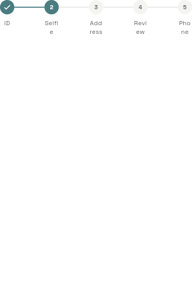

| Parameter | Type | Required | Default | Description |
|-----------|------|----------|---------|-------------|
| totalSteps | `int` | ✓ | — | Total number of steps in the progress indicator; must be positive. |
| currentStep | `int` | ✓ | — | The current active step, 1-indexed; must be between 1 and `totalSteps` inclusive. |
| labels | `List<String>?` | — | — | Optional label string for each step, displayed below the bubbles when `showLabels` is true. |
| showLabels | `bool` | — | `false` | Whether to render the per-step labels row beneath the step bubbles. |

#### BankDocumentCaptureOverlay

Camera frame guide for document capture that overlays on top of a host-provided camera widget and draws a rectangular cutout, L-shaped corner guides, an optional rule-of-thirds grid, a status pill, and a capture button when aligned.

| Parameter | Type | Required | Default | Description |
|-----------|------|----------|---------|-------------|
| framingState | `BankDocumentFramingState` (`idle` · `detecting` · `aligned` · `tooClose` · `tooFar` · `badLighting` · `blurry`) | ✓ | — | The detected document-alignment state that drives corner colour, status message, and capture button visibility. |
| cameraChild | `Widget` | ✓ | — | The host app's camera widget that sits behind the overlay in a `Stack`. |
| statusMessage | `String?` | — | — | Override the auto-generated status message; derived from `framingState` when null. |
| onCapture | `VoidCallback?` | — | — | Callback invoked when the capture button is tapped; null hides the button even when aligned. |
| showGrid | `bool` | — | `false` | When true, a rule-of-thirds grid is drawn inside the document cutout using thin dashed lines. |

#### BankLivenessCheckOverlay

Face-guide overlay for liveness detection that stacks a dark overlay with an oval cutout over a camera widget, draws an animated progress ring, an instruction label, and an optional retry button.

| Parameter | Type | Required | Default | Description |
|-----------|------|----------|---------|-------------|
| state | `BankLivenessState` (`idle` · `detecting` · `success` · `retry`) | ✓ | — | The current liveness-detection state that drives ring colour and feedback icons. |
| cameraChild | `Widget` | ✓ | — | The host app's camera widget that sits behind the overlay in a `Stack`. |
| instruction | `String?` | — | — | Current user instruction text (e.g. "Smile"); auto-generated from state when null. |
| detectionProgress | `double` | — | `0` | Completion progress of the liveness check in the range 0.0–1.0, animating the progress ring. |
| onRetry | `VoidCallback?` | — | — | Called when the user taps the retry button; only shown when `state` is `retry` and this is non-null. |

#### BankAsyncVerificationState

Under-review holding-state widget for manual KYC review that shows an animated pulsing document icon, sequentially-pulsing dots, a title, body message, optional estimated-time chip, and optional action buttons.

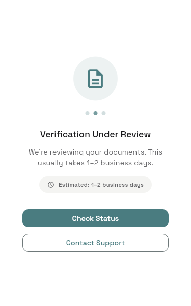

| Parameter | Type | Required | Default | Description |
|-----------|------|----------|---------|-------------|
| title | `String` | — | `'Verification Under Review'` | Primary heading displayed in `headlineSmall` style. |
| message | `String` | — | `'We're reviewing your documents. This usually takes 1–2 business days.'` | Body message describing the review process. |
| estimatedTime | `String?` | — | — | If provided, rendered in a chip below the message (e.g. `'1-2 business days'`). |
| customIllustration | `Widget?` | — | — | Slot for a custom illustration widget; animated document icon is rendered when null. |
| onCheckStatus | `VoidCallback?` | — | — | Called when the user taps the "Check Status" button; null hides the button. |
| onContactSupport | `VoidCallback?` | — | — | Called when the user taps the "Contact Support" button; null hides the button. |

#### BankConsentModal

Scrollable terms-acknowledgement modal that gates the Accept action behind the user scrolling to the bottom of the terms and explicitly checking the acknowledgement checkbox.

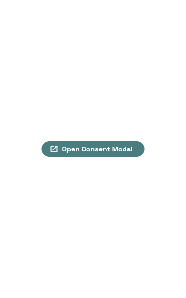

| Parameter | Type | Required | Default | Description |
|-----------|------|----------|---------|-------------|
| title | `String` | ✓ | — | Modal title shown in `headlineSmall` style. |
| termsContent | `String` | ✓ | — | Plain-text terms content; used when `richTermsContent` is null. |
| onAccept | `VoidCallback` | ✓ | — | Called when the user taps the Accept button (requires checkbox checked and scroll completed). |
| onDecline | `VoidCallback` | ✓ | — | Called when the user taps the Decline button. |
| richTermsContent | `Widget?` | — | — | If provided, used instead of `termsContent` to allow rich widgets such as rendered Markdown. |
| checkboxLabel | `String` | — | `'I have read and agree to the terms above'` | Checkbox label text; disabled until the user has scrolled to the bottom. |
| acceptLabel | `String` | — | `'Accept'` | Label for the accept (filled) button. |
| declineLabel | `String` | — | `'Decline'` | Label for the decline (outlined) button. |

---

### Saving

#### BankSavingsPotCard

Goal-based sub-account card with progress ring, target, and optional badges showing a `SavingsPot`'s name, balance, goal progress, interest rate, and shared-pot indicators.

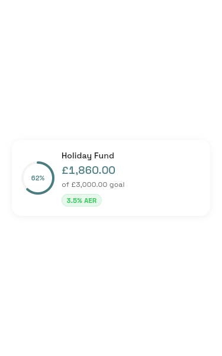

| Parameter | Type | Required | Default | Description |
|-----------|------|----------|---------|-------------|
| pot | `SavingsPot` | ✓ | — | The savings pot to display. |
| onTap | `VoidCallback?` | — | — | Called when the card is tapped. |
| onAddMoney | `VoidCallback?` | — | — | Called when the user taps the Add action button; its presence controls whether the button is rendered. |
| onWithdraw | `VoidCallback?` | — | — | Called when the user taps the Withdraw action button; its presence controls whether the button is rendered. |
| itemBuilder | `Widget Function(BuildContext, SavingsPot)?` | — | — | When non-null, completely overrides the card content with a custom widget tree. |

#### BankRoundUpSettingsSheet

Round-up configuration bottom sheet with a toggle, multiplier chip row (1×, 2×, 5×, 10×), and destination pot picker; callers own state and receive updates via callbacks.

| Parameter | Type | Required | Default | Description |
|-----------|------|----------|---------|-------------|
| isEnabled | `bool` | ✓ | — | Whether round-ups are currently enabled. |
| multiplier | `int` (`1` · `2` · `5` · `10`) | ✓ | — | Current round-up multiplier; must be one of 1, 2, 5, or 10. |
| availablePots | `List<SavingsPot>` | ✓ | — | Savings pots the user may direct round-ups into. |
| onEnabledChanged | `ValueChanged<bool>` | ✓ | — | Invoked when the user toggles the round-up switch. |
| onMultiplierChanged | `ValueChanged<int>` | ✓ | — | Invoked when the user selects a multiplier chip. |
| onPotSelected | `ValueChanged<String?>` | ✓ | — | Invoked when the user picks a destination pot; null when deselected. |
| selectedPotId | `String?` | — | — | The `SavingsPot.id` of the currently selected destination pot. |

#### BankPotContributionSheet

Manual add-to-pot or withdraw-from-pot bottom sheet presenting a large amount display, inline number pad, real-time validation, and a confirm button that triggers an async callback.

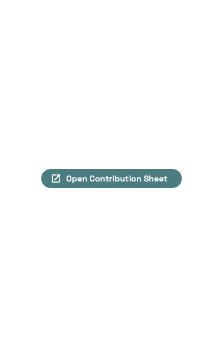

| Parameter | Type | Required | Default | Description |
|-----------|------|----------|---------|-------------|
| pot | `SavingsPot` | ✓ | — | The target savings pot. |
| onConfirm | `Future<void> Function(Money amount)` | ✓ | — | Called with the confirmed `Money` amount; a loading spinner is shown while it completes. |
| isWithdrawal | `bool` | — | `false` | When true, the sheet is in withdrawal mode; otherwise contribution mode. |
| availableBalance | `Money?` | — | — | Maximum available balance cap for withdrawals; null means uncapped. |
| onCancel | `VoidCallback?` | — | — | Called when the user cancels; when null, only the back gesture closes the sheet. |

#### BankIncomeSorterSheet

Bottom sheet triggered on a large incoming payment that lets the user split the amount across savings pots by percentage or fixed amount, backed by a `BankIncomeSorterController`.

| Parameter | Type | Required | Default | Description |
|-----------|------|----------|---------|-------------|
| controller | `BankIncomeSorterController` | ✓ | — | Controller that holds the incoming amount, pot entries, remaining balance, and confirmation logic. |
| onDismiss | `VoidCallback?` | — | — | Optional callback invoked when the sheet is dismissed. |

#### BankSharedPotInvite

Invite another account holder to view or contribute to a pot, displaying the current member list with optional remove actions and an invite button.

| Parameter | Type | Required | Default | Description |
|-----------|------|----------|---------|-------------|
| pot | `SavingsPot` | ✓ | — | The shared savings pot whose members are displayed. |
| currentMembers | `List<BankPotMember>` | ✓ | — | List of current pot members to render in the member list. |
| onInvite | `VoidCallback?` | — | — | Called when the user taps the Invite someone row; when null the row is hidden. |
| onRemoveMember | `Future<void> Function(String memberId)?` | — | — | Called with the member ID when the user removes a member; remove buttons are hidden when null. |

---

### Social Banking

#### BankJointTransactionListTile

A transaction tile that shows which joint account owner initiated it.

| Parameter | Type | Required | Default | Description |
|-----------|------|----------|---------|-------------|
| transaction | `Transaction` | ✓ | — | The transaction data to display, including merchant name, logo, and amount. |
| initiatorName | `String?` | — | — | Display name of the joint account owner who initiated the transaction; shown as a subtitle and avatar label. |
| initiatorAvatarUrl | `String?` | — | — | URL of the initiator's avatar image, rendered as a small overlay on the merchant logo. |
| onTap | `VoidCallback?` | — | — | Callback invoked when the tile is tapped. |
| itemBuilder | `Widget Function(BuildContext, Transaction)?` | — | — | Optional builder that fully replaces the default tile layout when provided. |

#### BankAccountOwnershipBadge

Small inline badge indicating account ownership role.

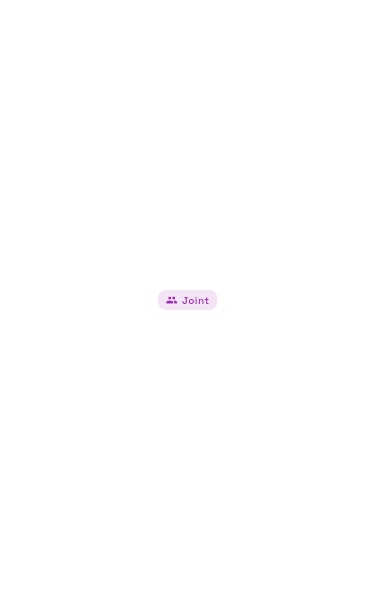

| Parameter | Type | Required | Default | Description |
|-----------|------|----------|---------|-------------|
| role | `BankOwnershipRole` (`primary` · `joint` · `beneficiary`) | ✓ | — | The ownership role; controls the icon, colours, and default label. |
| customLabel | `String?` | — | — | Overrides the default role label text when provided. |

#### BankSharedGoalProgressCard

A card showing a shared savings goal with contributor avatars and progress.

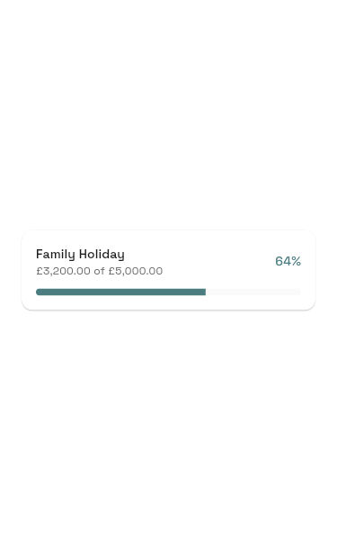

| Parameter | Type | Required | Default | Description |
|-----------|------|----------|---------|-------------|
| goalName | `String` | ✓ | — | Title of the shared savings goal displayed at the top of the card. |
| targetAmount | `Money` | ✓ | — | The total monetary target for the goal, used to compute progress percentage. |
| savedAmount | `Money` | ✓ | — | The amount saved so far, used to render the progress bar and saved/target label. |
| contributors | `List<BankGoalContributor>` | — | `const []` | List of contributors whose avatars are stacked below the progress bar. |
| illustration | `Widget?` | — | — | Optional 40×40 illustration or icon rendered to the left of the goal name. |
| onTap | `VoidCallback?` | — | — | Callback invoked when the card is tapped. |
| onContribute | `VoidCallback?` | — | — | Callback for the "Contribute" text button; button is hidden when null. |

---

### Investing

#### BankPortfolioPerformanceChart

Time-series chart wrapper sitting on top of `fl_chart` that wraps `fl_chart`'s `LineChart` with a range-selector button row.

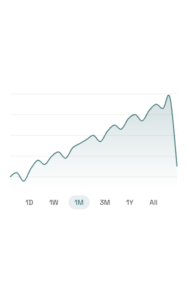

| Parameter | Type | Required | Default | Description |
|-----------|------|----------|---------|-------------|
| dataPoints | `List<BankChartDataPoint>` | ✓ | — | The time-series data points to plot on the chart. |
| showGrid | `bool` | — | `true` | Whether to draw horizontal grid lines behind the chart line. |
| lineColor | `Color?` | — | — | Override colour for the chart line; defaults to the theme accent gradient's first colour or primary. |
| selectedRange | `BankChartTimeRange` (`oneDay` · `oneWeek` · `oneMonth` · `threeMonths` · `oneYear` · `allTime`) | — | `BankChartTimeRange.oneMonth` | The currently active time-range filter shown in the button row. |
| onRangeChanged | `ValueChanged<BankChartTimeRange>?` | — | — | Called when the user taps a different range button, passing the new `BankChartTimeRange` value. |

#### BankHoldingsListTile

A portfolio position row designed for use inside a `ListView.builder`.

| Parameter | Type | Required | Default | Description |
|-----------|------|----------|---------|-------------|
| holding | `Holding` | ✓ | — | The portfolio holding data to display (name, symbol, quantity, value, gain/loss). |
| onTap | `VoidCallback?` | — | — | Called when the user taps the tile. |
| itemBuilder | `Widget Function(BuildContext, Holding)?` | — | — | Optional builder that fully replaces the default tile layout when provided. |

#### BankWatchlistCard

A saved/watched asset card with quick-glance price and a watchlist toggle star button.

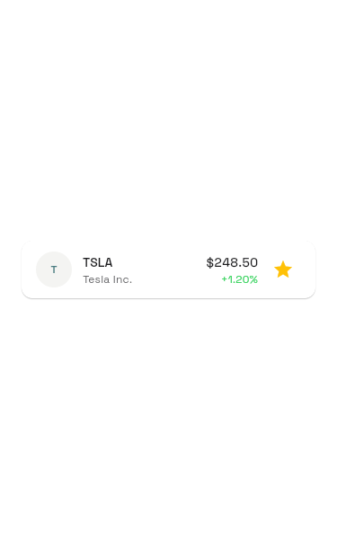

| Parameter | Type | Required | Default | Description |
|-----------|------|----------|---------|-------------|
| quote | `AssetQuote` | ✓ | — | The asset quote data (symbol, name, price, change percentage, logo URL) to display. |
| isWatched | `bool` | — | `true` | Whether the asset is currently on the watchlist; controls the star icon fill state. |
| onToggleWatch | `VoidCallback?` | — | — | Called when the user taps the star icon to add or remove the asset from the watchlist. |
| onTap | `VoidCallback?` | — | — | Called when the user taps the card body. |

#### BankBuySellSheet

Order-entry modal bottom sheet for buying or selling an asset, with market and optional limit order support.

| Parameter | Type | Required | Default | Description |
|-----------|------|----------|---------|-------------|
| quote | `AssetQuote` | ✓ | — | The asset quote data used to display the asset symbol, logo, and current price. |
| initialSide | `BankOrderSide` (`buy` · `sell`) | — | `BankOrderSide.buy` | Which order side is pre-selected when the sheet opens. |
| allowLimitOrder | `bool` | — | `false` | When true, shows a Market/Limit segmented button and an extra limit-price text field. |
| availableBalance | `Money?` | — | — | If provided, displays the user's available balance below the amount field. |
| onSubmit | `Future<void> Function(BankOrderSide, BankOrderType, double, double?)?` | — | — | Async callback invoked when the user confirms the order; receives side, order type, amount, and optional limit price. |

#### BankAssetPriceTicker

Compact price and change-percentage row for a stock, ETF, or crypto asset with a logo circle and colour-coded change badge.

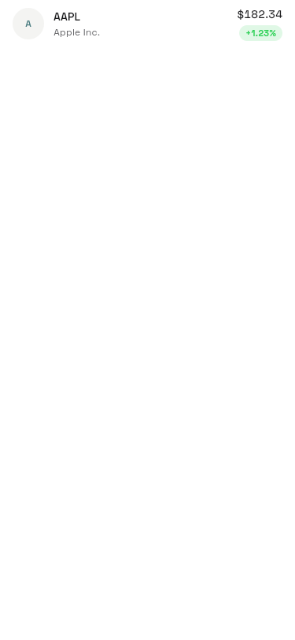

| Parameter | Type | Required | Default | Description |
|-----------|------|----------|---------|-------------|
| quote | `AssetQuote` | ✓ | — | The quote data to display (symbol, name, price, change percent, logo URL). |
| onTap | `VoidCallback?` | — | — | Called when the row is tapped; no tap interaction when null. |
| compact | `bool` | — | `false` | When true, hides the asset name and shows only the symbol, price, and change badge. |

#### BankLiveExchangeConverter

Two-sided live currency converter where editing either field recomputes the other automatically, with a swap button and a Convert action.

| Parameter | Type | Required | Default | Description |
|-----------|------|----------|---------|-------------|
| rate | `ExchangeRate` | ✓ | — | The current exchange rate used for conversion; the widget recalculates when this value changes. |
| onConvert | `VoidCallback?` | — | — | Called when the user taps the Convert button (enabled only when the entered amount is positive). |
| onAmountChanged | `ValueChanged<Money>?` | — | — | Called whenever the FROM amount changes, passing the computed `Money` value in the FROM currency. |

#### BankCurrencyWalletTabBar

Horizontal scrollable tab row showing one tab per currency wallet, with the selected tab highlighted and auto-scrolled into view.

| Parameter | Type | Required | Default | Description |
|-----------|------|----------|---------|-------------|
| wallets | `List<BankCurrencyWallet>` | ✓ | — | The list of currency wallets to display, one tab per wallet entry. |
| selectedIndex | `int` | ✓ | — | Index of the currently selected tab; drives the active highlight and auto-scroll. |
| onSelected | `ValueChanged<int>` | ✓ | — | Called with the tapped tab's index when the user selects a different wallet tab. |

---

### Credit

#### BankCreditLimitGauge

270° arc gauge showing used credit vs total credit limit.

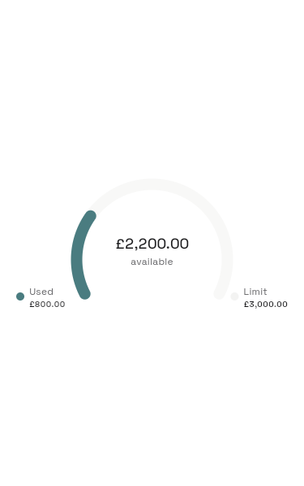

| Parameter | Type | Required | Default | Description |
|-----------|------|----------|---------|-------------|
| creditLimit | `Money` | ✓ | — | The total credit limit to display on the gauge. |
| usedAmount | `Money` | ✓ | — | The amount of credit already used, shown as the filled arc. |
| label | `String?` | — | — | Optional accessibility label override; defaults to "Credit limit". |

#### BankFlexEligibleBadge

Inline chip indicating a transaction is eligible for flexible installments.

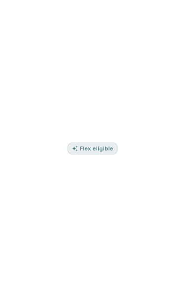

| Parameter | Type | Required | Default | Description |
|-----------|------|----------|---------|-------------|
| label | `String?` | — | — | Text shown in the badge chip; defaults to "Flex eligible". |
| onTap | `VoidCallback?` | — | — | When non-null, the badge is treated as a button for accessibility. |

#### BankInstallmentPlanSelector

Lets the user choose an installment plan from a list of selectable cards, with Islamic finance mode support.

| Parameter | Type | Required | Default | Description |
|-----------|------|----------|---------|-------------|
| plans | `List<InstallmentPlan>` | ✓ | — | The list of installment plans to display as selectable cards. |
| selectedPlan | `InstallmentPlan?` | — | — | The currently selected plan; the matching card is highlighted. |
| onPlanSelected | `ValueChanged<InstallmentPlan>?` | — | — | Callback invoked when the user taps a plan card. |
| islamicFinanceMode | `bool` | — | `false` | When true, replaces "APR" terminology with "Profit rate"; also inherited from `BankUiScope` if set there. |

#### BankRepaymentScheduleView

Vertical list of monthly repayment rows generated from an `InstallmentPlan`.

| Parameter | Type | Required | Default | Description |
|-----------|------|----------|---------|-------------|
| plan | `InstallmentPlan` | ✓ | — | The installment plan whose schedule is rendered row-by-row. |
| highlightMonthIndex | `int?` | — | — | Zero-based index of the month row to visually highlight (e.g. the current payment). |
| islamicFinanceMode | `bool` | — | `false` | When true, labels the interest column as "Profit" instead of "Interest"; also inherited from `BankUiScope`. |

---

### Notifications

#### BankInAppNotificationCenter

A scrollable notification feed with read/unread states and swipe-to-dismiss.

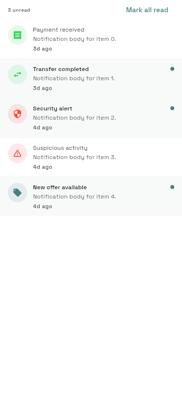

| Parameter | Type | Required | Default | Description |
|-----------|------|----------|---------|-------------|
| notifications | `List<BankNotification>` | ✓ | — | The list of bank notifications to display in the feed. |
| onNotificationTap | `void Function(BankNotification)?` | — | — | Callback invoked when the user taps a notification item. |
| onDismiss | `void Function(BankNotification)?` | — | — | Callback invoked when the user swipe-dismisses a notification; enables `Dismissible` wrapping when non-null. |
| onMarkAllRead | `VoidCallback?` | — | — | Callback for the "Mark all read" button shown when unread notifications exist. |
| emptyState | `Widget?` | — | — | Custom widget to display when the notifications list is empty; defaults to a centred icon and label. |

---

### Subscriptions

#### BankPlanComparisonTable

Side-by-side plan tier comparison table that is horizontally scrollable when there are more than 3 tiers, with tappable tier headers and a primary-coloured emphasis border for the highlighted tier.

| Parameter | Type | Required | Default | Description |
|-----------|------|----------|---------|-------------|
| tiers | `List<BankPlanTier>` | ✓ | — | The list of plan tiers to display as columns in the comparison table. |
| highlightedTierId | `String?` | — | — | The ID of the tier that receives the primary-coloured 2 px emphasis border. |
| onSelectTier | `ValueChanged<BankPlanTier>?` | — | — | Callback invoked when the user taps a tier header; makes headers tappable when provided. |

#### BankPaywallSheet

Upsell bottom sheet shown when a free-tier user attempts to access a paid-only feature, presenting available plan cards with upgrade actions.

| Parameter | Type | Required | Default | Description |
|-----------|------|----------|---------|-------------|
| featureName | `String` | ✓ | — | The name of the paid feature the user is trying to access, shown in the headline. |
| description | `String` | ✓ | — | A supporting description shown below the headline explaining the upgrade benefit. |
| plans | `List<BankPlanTier>` | ✓ | — | The list of available plan tiers; a single plan renders as one card, multiple as a horizontal list. |
| currentTierId | `String?` | — | — | The ID of the user's current tier so that plan card can be marked as "Current plan". |
| onUpgrade | `ValueChanged<BankPlanTier>?` | — | — | Callback invoked when the user taps the Upgrade button on a plan card. |
| onDismiss | `VoidCallback?` | — | — | Callback invoked when the user taps "Maybe later"; defaults to `Navigator.pop` when not provided. |

#### BankPerksMarketplaceCard

Marketplace card for a single partner perk showing the partner logo (or initials fallback), title, discount badge, expiry hint, and an Activate button or Activated chip based on state.

| Parameter | Type | Required | Default | Description |
|-----------|------|----------|---------|-------------|
| perk | `BankPerk` | ✓ | — | The perk data model containing partner name, title, description, logo URL, discount label, expiry date, and activation state. |
| onActivate | `VoidCallback?` | — | — | Callback invoked when the user taps the Activate button; also controls whether the action row is shown. |
| onTap | `VoidCallback?` | — | — | Callback invoked when the user taps anywhere on the card, making the whole card interactive. |

#### BankReferralInviteCard

Referral invite card with a shareable code, reward description, and pending/rewarded/expired state handling.

| Parameter | Type | Required | Default | Description |
|-----------|------|----------|---------|-------------|
| referralCode | `String` | ✓ | — | The referral code string displayed in the monospaced code box with a copy button. |
| rewardDescription | `String?` | — | — | Optional text describing the reward the user earns for successful referrals. |
| referralCount | `int` | — | `0` | Number of friends already invited, displayed as a count label below the code box. |
| maxReferrals | `int?` | — | — | Optional cap on referrals; when provided the count label reads "X of Y". |
| state | `BankReferralState` (`pending` · `rewarded` · `expired`) | — | `BankReferralState.pending` | The current state of the referral offer, controlling the overlay and interactivity of the card. |
| onShare | `VoidCallback?` | — | — | Callback invoked when the user taps the Share Invite button; button is hidden when null or when `state` is `expired`. |
| onCopyCode | `VoidCallback?` | — | — | Callback invoked after the referral code is copied to the clipboard via the copy icon button. |

---

> Generated from source — run `dart doc` for the full API reference.
